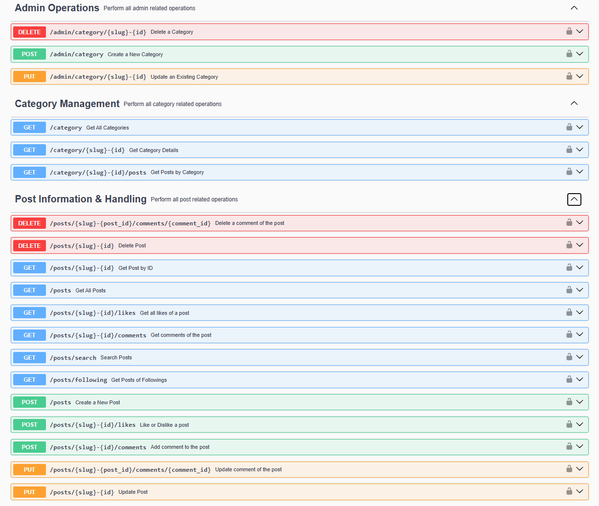
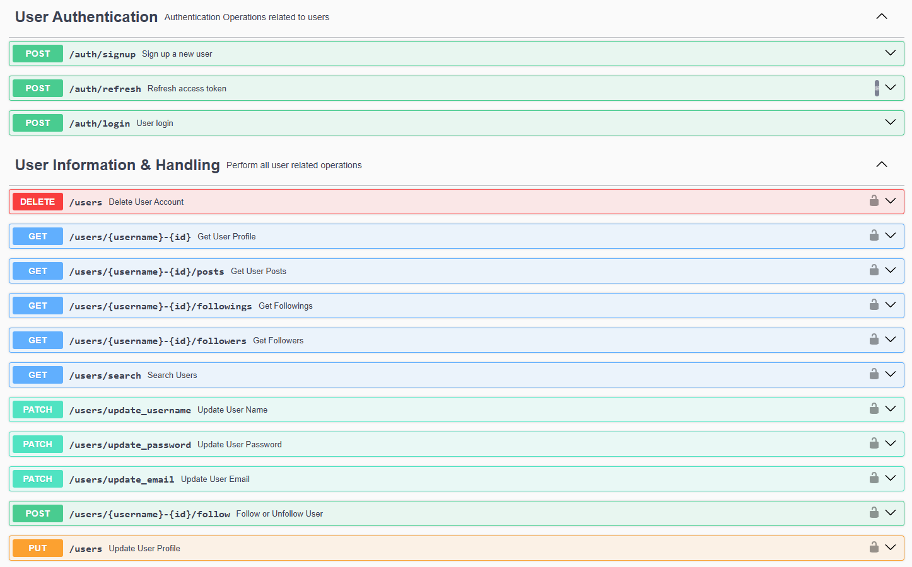
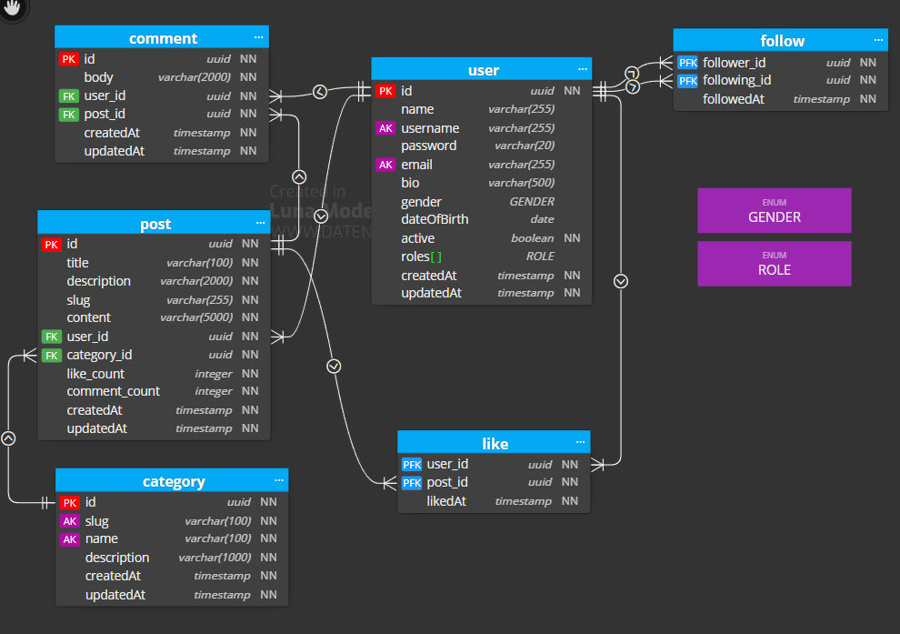

# Blog Management System APIs Backend

---

## Overview

This application provides backend APIs for a **Blog Management System**, including

- **Admin Operations**
- **Category Management**
- **Post Information & Handling**
- **User Authentication**
- **User Information & Handling**

## API Endpoints

### Admin Operations

| HTTP Methods | API Endpoints                 | Description                 |
|--------------|-------------------------------|-----------------------------|
| `DELETE`     | `/admin/category/{slug}-{id}` | Delete an existing category |
| `POST`       | `/admin/category`             | Create a new category       |
| `PUT`        | `/admin/category/{slug}-{id}` | Update an existing category |

### Category Management

| HTTP Methods | API Endpoints                 | Description                                      |
|--------------|-------------------------------|--------------------------------------------------|
| `GET`        | `/category`                   | Get all existing categories                      |
| `GET`        | `/category/{slug}-{id} `      | Get the category details for a specific category |
| `GET`        | `/category/{slug}-{id}/posts` | Get all the posts for a specific category        |

### Post Information & Handling

| HTTP Methods | API Endpoints                                   | Description                                        |
|--------------|-------------------------------------------------|----------------------------------------------------|
| `DELETE`     | `/posts/{slug}-{post_id}/comments/{comment_id}` | Delete an existing comment for a particular post   |
| `DELETE`     | `/posts/{slug}-{id}`                            | Delete an existing post                            |
| `GET`        | `/posts/{slug}-{id}`                            | Get the details of an existing post                |
| `GET`        | `/posts`                                        | Get all the posts                                  |
| `GET`        | `/posts/{slug}-{id}/likes`                      | Get the likes of an existing post                  |
| `GET`        | `/posts/{slug}-{id}/comments`                   | Get the comments of an existing post               |
| `GET`        | `/posts/search`                                 | Search post by title                               |
| `GET`        | `/posts/following`                              | Get the post of the followings of the current user |
| `POST`       | `/posts`                                        | Create a new post                                  |
| `POST`       | `/posts/{slug}-{id}/likes`                      | Like or Dislike an existing post                   |
| `POST`       | `/posts/{slug}-{id}/comments`                   | Add comments to an existing post                   |
| `PUT`        | `/posts/{slug}-{post_id}/comments/{comment_id}` | Update a specific comment of a specific post       |
| `PUT`        | `/posts/{slug}-{id}`                            | Update an existing post                            |

### User Authentication

| HTTP Methods | API Endpoints   | Description                                          |
|--------------|-----------------|------------------------------------------------------|
| `POST`       | `/auth/signup`  | Sign up a new user                                   |
| `POST`       | `/auth/refresh` | Generate the refresh token for an authenticated user |
| `POST`       | `/auth/login`   | Login an existing user                               |

### User Information & Handling

| HTTP Methods | API Endpoints                       | Description                             |
|--------------|-------------------------------------|-----------------------------------------|
| `DELETE`     | `/users`                            | Delete the current user                 |
| `GET`        | `/users/{username}-{id}`            | Get the details for a particular user   |
| `GET`        | `/users/{username}-{id}/posts`      | Get the posts for a particular user     |
| `GET`        | `/users/{username}-{id}/followings` | Get the following for a particular user |
| `GET`        | `/users/{username}-{id}/followers`  | Get the followers for a particular user |
| `GET`        | `/users/search`                     | Search users by their username          |
| `PATCH`      | `/users/update_username`            | Update the username of the current user |
| `PATCH`      | `/users/update_password`            | Update the password of the current user |
| `PATCH`      | `/users/update_email`               | Update the email of the current user    |
| `POST`       | `/users/{username}-{id}/follow`     | Follow or Unfollow an existing user     |
| `PUT`        | `/users`                            | Update current user profile             |

## Entity Relationship Diagram

